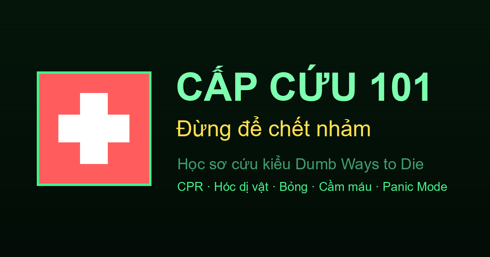
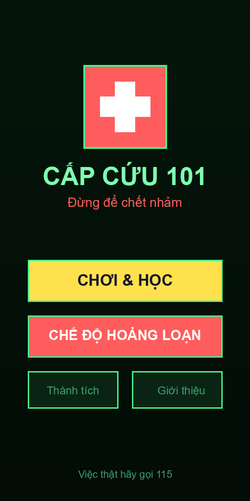
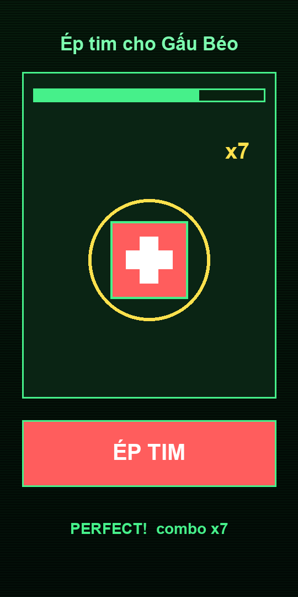

# 🚑 Cấp Cứu 101: Đừng Để Chết Nhảm



[](https://tridpt.github.io/cap-cuu-101/)
[](https://tridpt.github.io/cap-cuu-101/)
[](LICENSE)


> Học sơ cứu kiểu *Dumb Ways to Die* — vui, châm biếm, nhưng kiến thức thì thật.

Một web app dạy kỹ năng sơ cứu sinh tử (CPR, hóc dị vật, bỏng, cầm máu...) qua **mini-game hoạt hình hài hước**. Làm sai? Nhân vật "đăng xuất khỏi cuộc đời" cực buồn cười. Gặp chuyện thật? Bật **Chế độ Hoảng loạn** để app đọc to từng bước cho bạn làm theo.

100% HTML/CSS/JS thuần — không khung, không build, **chạy offline (PWA)**. Song ngữ 🇻🇳/🇬🇧.

| Màn hình chính | Mini-game CPR |
|:--:|:--:|
|  |  |

> ⚠️ Đây là sản phẩm giải trí + ghi nhớ. Nó **không** thay thế khoá sơ cứu chính quy
> hay nhân viên y tế. Việc thật: **gọi 115 trước tiên.** Xem `MEDICAL_REVIEW.md` cho
> checklist rà soát nội dung bởi nhân viên y tế.

---

## 🎮 Các mini-game

| Màn | Kỹ năng thật | Cách chơi |
|-----|--------------|-----------|
| 🐻 **Ép tim cho Gấu Béo** | CPR người lớn đúng nhịp 100–120/phút | Chạm theo vòng tròn nảy ra — tiếng "tách" + rung theo nhịp, tính combo |
| 👶 **CPR cho em bé Bông** | CPR trẻ sơ sinh (2 ngón cái, ~4cm) | Như trên nhưng nhấn mạnh khác biệt ở trẻ sơ sinh |
| 👽 **Người ngoài hành tinh nghẹn trân châu** | Heimlich (vỗ lưng + đẩy bụng) | Nghiêng điện thoại đẩy bụng (hoặc nhấn-giữ-thả) |
| 🍼 **Bé Bông hóc dị vật** | Trẻ sơ sinh: vỗ lưng + ấn ngực, KHÔNG đẩy bụng | Trả lời nhanh các tình huống |
| 🧑‍🍳 **Cứu đầu bếp bị bỏng** | Xả nước mát chữa bỏng | Rê vòi nước 🚿 đè lên vết bỏng, giữ đủ lâu — vết bỏng còn **lan sang chỗ khác** |
| 🧟 **Cầm máu cho Zombie** | Đặt gạc & ép cầm máu | Kéo gạc vào vết thương, giữ thanh lực trong **vùng xanh đang di chuyển** |
| 🌊 **Đuối nước** · ⚡ **Điện giật** · 🌀 **Co giật** · 🐝 **Sốc phản vệ** · 🦴 **Gãy xương** · 🐍 **Rắn cắn** · 🧠 **Đột quỵ (FAST)** · 🍬 **Hạ đường huyết** · 🥵 **Sốc nhiệt** · ☠️ **Ngộ độc** | Xử lý đúng trình tự | Trả lời nhanh các tình huống sinh tử |

Mỗi màn cho tối đa **3 sao** (lưu trong trình duyệt), kèm một mẹo đời thực sau khi chơi.

## 🔊 Âm thanh & rung

- Tiếng "tách" metronome + rung theo nhịp khi ép tim (Web Audio API, tự tổng hợp — chạy offline)
- Tiếng "ting" khi đúng, "kèn tụt dốc" khi nhân vật đăng xuất, fanfare khi thắng
- Nhạc nền 8-bit bật/tắt được
- Tất cả bật/tắt trong ⚙️ **Cài đặt** (âm thanh / nhạc / rung), lưu lại cho lần sau

## 🏆 Thành tích & chuỗi ngày

- Màn **Thành tích**: tổng sao, số màn 3 sao, lượt cứu sống, combo CPR tốt nhất
- **8 huy hiệu** mở khoá dần (Lính mới, Bậc thầy CPR, Tay nhịp vàng, Cứu tinh, Kiên trì...)
- **Chuỗi ngày** (streak): chơi mỗi ngày để nối chuỗi ôn tập

## ✨ Trải nghiệm

- **Splash screen** khi mở app
- **Hướng dẫn nhanh** hiện lần đầu chơi mỗi kiểu mini-game (chỉ 1 lần, lưu localStorage)
- Nhân vật **lắc lư sống động**, hiệu ứng chuyển màn & nảy thẻ mượt
- **Screenshot** trong manifest → nút "Install" của trình duyệt hiển thị đẹp hơn

## 🌐 Đa ngôn ngữ (Tiếng Việt / English)

- Đổi ngôn ngữ trong ⚙️ **Cài đặt** → 🌐 (VI/EN), lưu lại cho lần sau
- Dịch toàn bộ: giao diện, nội dung mini-game, câu hỏi, và **Chế độ Hoảng loạn** (giọng đọc tự đổi sang `en-US` khi ở chế độ English)
- Trẻ sơ sinh & các tình huống đều có cả hai ngôn ngữ

> Ở chế độ English, phần đọc to dùng giọng tiếng Anh và nói "call emergency services" thay cho số 115 (vì số khẩn cấp khác nhau theo quốc gia).

## 📤 Chia sẻ & 🔔 Nhắc ôn tập

- **Chia sẻ**: sau khi thắng một màn hoặc ở màn Thành tích, bấm **Chia sẻ** — app tạo sẵn một tấm thẻ ảnh (canvas) kèm điểm/sao/huy hiệu và dùng **Web Share API** để gửi qua mạng xã hội/tin nhắn. Thiết bị không hỗ trợ thì tự **chép link** vào clipboard.
- **Link preview đẹp**: đã thêm thẻ Open Graph + ảnh `screenshots/og.png` (1200×630), nên khi dán link lên Zalo/Facebook/Messenger sẽ hiện ảnh + mô tả.
- **Nhắc ôn tập**: bật trong ⚙️ Cài đặt → 🔔. App xin quyền thông báo; khi bạn mở lại app vào ngày mới mà chuỗi đang chờ nối, app sẽ bắn một thông báo nhắc.

> ⚠️ Đây là nhắc **khi mở app** (không có máy chủ đẩy thông báo nền). Thông báo đẩy chạy nền kể cả khi đóng app cần thêm hạ tầng web push (server + VAPID) — chưa làm trong bản này.

## 🆘 Chế độ Hoảng loạn (Panic Mode)

Khi sự cố xảy ra thật:
1. Mở app → **CHẾ ĐỘ HOẢNG LOẠN**
2. Chọn tình huống — **17 loại**: ngừng tim, nhồi máu cơ tim, CPR trẻ sơ sinh, hóc nghẹn, trẻ sơ sinh hóc, bỏng, chảy máu, đuối nước, điện giật, co giật, sốc phản vệ, gãy xương, rắn cắn, đột quỵ, hạ đường huyết, sốc nhiệt, ngộ độc
3. App **đọc to từng bước** ngắn gọn, bình tĩnh — bấm "Bước tiếp" để đi tiếp
4. Riêng CPR có **nhịp metronome 100/phút** kèm rung để ép tim đúng nhịp
5. Nút **📞 GỌI 115** luôn hiện sẵn (nhạc nền tự tắt khi vào chế độ này)

## ▶️ Chạy thử

Không cần cài đặt gì. Chỉ là HTML/CSS/JS thuần.

- **Cách nhanh:** mở thẳng `index.html` bằng trình duyệt.
- **Khuyến nghị** (để giọng nói, cảm biến & PWA hoạt động đúng): chạy qua HTTP.

```bash
# tại thư mục cap-cuu-101
python -m http.server 8000
```
Rồi mở `http://localhost:8000` (hoặc IP máy tính từ điện thoại cùng mạng Wi-Fi).

> Service worker chỉ hoạt động khi truy cập qua `http(s)://` (localhost hoặc GitHub Pages),
> không chạy khi mở bằng `file://`.

## 📲 Cài như app (PWA) & chạy offline

App là một **Progressive Web App**: cài được lên màn hình chính và **chạy offline 100%**.
Điều này quan trọng cho app cấp cứu — **Chế độ Hoảng loạn vẫn dùng được khi mất mạng**.

- **Android (Chrome/Edge):** mở link → menu ⋮ → *Cài đặt ứng dụng / Add to Home screen*.
- **iOS (Safari):** nút Chia sẻ → *Thêm vào MH chính*.
- **Desktop (Chrome/Edge):** biểu tượng cài đặt ở thanh địa chỉ.

Sau khi cài, giữ một lối tắt **"Chế độ Hoảng loạn"** mở thẳng hướng dẫn khẩn cấp
(qua `?panic=1`). Lần đầu vào cần có mạng để service worker lưu cache; sau đó offline vô tư.

> 💡 Giọng nói (TTS) hoạt động offline nếu thiết bị đã cài sẵn giọng tiếng Việt.
> Nếu chưa có giọng `vi-VN` offline, phần đọc to có thể cần mạng tuỳ hệ điều hành.

## 📱 Lưu ý kỹ thuật

- **Giọng nói** dùng Web Speech API — **chỉ đọc đúng tiếng Việt nếu thiết bị có cài giọng `vi-VN`**.
  Nếu không có, trình duyệt lấy giọng tiếng Anh đọc chữ Việt nghe sai hoàn toàn.
  - Trong ⚙️ Cài đặt có mục **🗣️ Giọng đọc**: chọn giọng cụ thể, hoặc **Tắt giọng đọc** (đọc theo chữ trên màn hình).
  - App **cảnh báo** khi máy chưa có giọng tiếng Việt.
  - **Cài giọng tiếng Việt trên Windows:** Settings → Time & Language → Language & region → thêm *Tiếng Việt*, rồi vào *Language options* tải gói **Speech**. Khởi động lại trình duyệt.
  - Android/iOS thường có sẵn giọng tiếng Việt; Chrome/Edge desktop có thể không.
- **Cảm biến nghiêng** (game người ngoài hành tinh) cần thiết bị có gyroscope.
  Trên iOS phải bấm cho phép; máy không có cảm biến tự chuyển sang chế độ chạm.
- **Rung** dùng Vibration API (chủ yếu Android).
- Tiến độ sao lưu bằng `localStorage` — xoá dữ liệu trình duyệt là mất.

## 🏁 Chế độ Survival

Vào màn **Chơi & Học** → thẻ **🏁 Thi đấu Survival** ở trên cùng.

- Trả lời **liên tục** các câu hỏi rút ngẫu nhiên từ tất cả tình huống
- Mỗi câu có **đồng hồ đếm ngược** (~9 giây); hết giờ hoặc sai một câu là **kết thúc**
- Tính **điểm + combo**, lưu **kỷ lục** (localStorage), có nút chia sẻ kết quả
- Huy hiệu **🏁 Cao thủ Survival** khi đạt 10 điểm
- Hoạt động song ngữ VI/EN

## ♿ Khả năng tiếp cận & 🎓 Chế độ nghiêm túc

Bật trong ⚙️ **Cài đặt** (lưu lại cho lần sau):

- **🔆 Tương phản cao** — tăng độ tương phản chữ/nền cho dễ đọc
- **🔠 Chữ lớn** — phóng to cỡ chữ toàn app, hợp người lớn tuổi
- **🎬 Giảm chuyển động** — tắt bớt hiệu ứng cho người nhạy cảm (cũng tự tôn trọng `prefers-reduced-motion` của hệ điều hành); riêng nhịp metronome CPR vẫn giữ vì là chức năng dẫn nhịp
- **🎓 Chế độ nghiêm túc** — bỏ phần "đăng xuất khỏi cuộc đời" và dùng từ ngữ trung tính ("Hoàn thành đúng cách" / "Chưa đạt — thử lại"), hợp lớp học & môi trường y tế

Thêm các hỗ trợ khác: nhãn ARIA cho nút biểu tượng, vùng `aria-live` đọc to bước Panic Mode & hướng dẫn game, ẩn `aria-hidden` các màn không hiển thị, viền focus rõ khi điều hướng bàn phím, và nút **ÉP TIM** chơi được bằng phím Space/Enter. Các câu hỏi trắc nghiệm vốn là `<button>` nên dùng bàn phím tốt.

> Lưu ý: các mini-game thao tác bằng cảm ứng (kéo vòi nước, giữ ép, nghiêng máy) khó thao tác bằng bàn phím — phần trắc nghiệm & Panic Mode là kênh học tập tiếp cận đầy đủ cho mọi người.

## 🧰 Công cụ khẩn cấp (dùng ngoài đời thật)

Nút **🧰 CÔNG CỤ KHẨN CẤP** ở trang chủ (có cả PWA shortcut `?tools=1`):

- **🥁 Máy đếm nhịp CPR** — bấm một nút là phát ngay nhịp **110/phút** (tiếng tách + rung + đếm 1–30) để ép tim đúng nhịp trong tình huống thật
- **🆘 Gọi khẩn cấp 1 chạm** — 115 (cấp cứu), 113 (công an), 114 (cứu hoả/cứu nạn), 111 (bảo vệ trẻ em), mỗi số một nút gọi `tel:`
- **🪪 Thẻ y tế cá nhân** — lưu nhóm máu, dị ứng, bệnh nền/thuốc, người liên hệ (offline, trong máy bạn). Hiển thị thẻ to rõ cho người cứu hộ đọc + nút **gọi người thân 1 chạm**

> Thẻ y tế lưu bằng `localStorage` trên thiết bị, không gửi đi đâu cả.

## 📖 Cẩm nang tra cứu nhanh

Nút **📖 Cẩm nang sơ cứu** ở trang chủ: danh sách 17 tình huống dạng gập/mở, bấm vào là xem ngay các bước chính để **đọc lướt** bất cứ lúc nào (không cần chơi, không cần giọng đọc). Tái dùng đúng nội dung của Chế độ Hoảng loạn, song ngữ VI/EN.

## 📚 Tài liệu

- **`FEATURES.md`** — danh sách đầy đủ tính năng
- **`DOCUMENTATION.md`** — kiến trúc, cấu trúc mã, mô hình dữ liệu, cách mở rộng
- **`CONTRIBUTING.md`** — quy ước đóng góp & kiểm tra
- **`HUONG_DAN_TEST.md`** — checklist test thủ công từng bước
- **`CHANGELOG.md`** — lịch sử thay đổi theo phiên bản
- **`MEDICAL_REVIEW.md`** — checklist cho nhân viên y tế rà soát nội dung

## 📂 Cấu trúc

```
cap-cuu-101/
├─ index.html   # màn hình: Home, Chọn màn, Game, Panic, Thành tích, Giới thiệu, Cài đặt
├─ style.css    # giao diện tối, cartoon, châm biếm
├─ sound.js     # module âm thanh Web Audio (hiệu ứng + nhạc nền 8-bit) + cài đặt
├─ app.js       # điều hướng + engine mini-game + Panic Mode (TTS) + thành tích + SW
├─ manifest.json# khai báo PWA (tên, icon, shortcut Hoảng loạn)
├─ sw.js        # service worker: precache app shell -> chạy offline
├─ gen_icons.py # script tạo icon PNG (chạy 1 lần, cần Pillow)
├─ gen_screens.py # script tạo ảnh screenshot cho manifest (cần Pillow)
├─ gen_og.py    # script tạo ảnh Open Graph 1200x630 cho link preview (cần Pillow)
├─ MEDICAL_REVIEW.md # checklist cho nhân viên y tế rà soát nội dung
├─ icon.svg
├─ icons/       # icon-192.png, icon-512.png
├─ screenshots/ # home.png, game.png, og.png
└─ README.md
```

## 🧠 Nội dung sơ cứu tham khảo

Các bước được biên soạn dựa trên hướng dẫn sơ cứu phổ thông và đối chiếu với tài liệu của
các tổ chức y tế uy tín (lần đối chiếu gần nhất: **06/2026**). Nội dung rút gọn cho dễ nhớ;
vẫn nên học một khoá sơ cứu thực hành có người hướng dẫn để thao tác chuẩn.

| Chủ đề | Điểm chính | Nguồn |
|--------|-----------|-------|
| CPR | 100–120 nhịp/phút, sâu ~5–6cm, giữa ngực; chưa đào tạo thì ép tim liên tục | [AHA](https://cpr.heart.org/en/resuscitation-science/cpr-and-ecc-guidelines) |
| Nhồi máu cơ tim | Đau tức giữa ngực lan tay/hàm, khó thở, vã mồ hôi → gọi cấp cứu ngay, ngồi nghỉ, nhai aspirin nếu không dị ứng | [AHA](https://www.heart.org/en/health-topics/heart-attack/warning-signs-of-a-heart-attack) |
| CPR trẻ sơ sinh | Hai ngón cái ôm ngực, sâu ~4cm (1/3 lồng ngực), 100–120/phút | [AHA Pediatric BLS](https://cpr.heart.org/en/resuscitation-science/cpr-and-ecc-guidelines/pediatric-basic-life-support) |
| Hóc dị vật | Xen kẽ **5 vỗ lưng + 5 đẩy bụng** (người lớn & trẻ >1 tuổi); trẻ sơ sinh: **5 vỗ lưng + 5 ấn ngực, KHÔNG đẩy bụng** | [Mayo Clinic](https://www.mayoclinic.org/first-aid/first-aid-choking/basics/art-20056637), [AHA 2025](https://newsroom.heart.org/news/updated-cpr-guidelines-tackle-choking-response-opioid-related-emergencies-and-a-revised-chain-of-survival) |
| Sốc phản vệ | Adrenaline tiêm mặt ngoài đùi, gọi cấp cứu, nằm kê chân cao | [NHS inform](https://www.nhsinform.scot/illnesses-and-conditions/immune-system/anaphylaxis) |
| Rắn cắn | Bất động, không garô chặt/rạch/hút nọc, tới viện gấp | [WHO](https://www.who.int/news-room/fact-sheets/detail/snakebite-envenoming) |
| Đột quỵ | Nhận biết **FAST/BE-FAST**, gọi cấp cứu ngay, không cho ăn uống, ghi giờ khởi phát | [Cleveland Clinic](https://health.clevelandclinic.org/be-fast-stroke), [American Stroke Assoc.](https://www.stroke.org/) |
| Hạ đường huyết | Còn tỉnh: cho đường nhanh; bất tỉnh: không cho gì vào miệng + gọi cấp cứu | [NHS](https://www.nhs.uk/conditions/low-blood-sugar-hypoglycaemia/) |
| Sốc nhiệt | Làm mát tích cực (nước/quạt/đá ở nách-bẹn-cổ), gọi cấp cứu | [American Stroke Assoc.](https://www.stroke.org/en/professionals/stroke-resource-library/prevention/heat-stroke-vs-stroke), [OSHA](https://www.osha.gov/heat-exposure/heat-illness) |
| Ngộ độc | KHÔNG tự gây nôn, gọi chống độc, giữ lại bao bì chất độc | [Mayo Clinic](https://www.mayoclinic.org/first-aid/first-aid-poisoning/basics/art-20056657) |
| Bỏng, chảy máu, gãy xương, co giật, đuối nước, điện giật | Sơ cứu phổ thông | [WHO](https://www.who.int/), [American Red Cross](https://www.redcross.org/take-a-class/first-aid) |

> 🩺 Hướng dẫn sơ cứu có thể thay đổi theo thời gian. Khi có khác biệt, hãy tin tưởng hướng
> dẫn của cơ quan y tế và tổng đài **115**. App này là công cụ giải trí + ghi nhớ, **không**
> thay thế đào tạo sơ cứu chính quy hay can thiệp y tế.
>
> *Một số nội dung đã được diễn đạt lại cho phù hợp mục đích học tập và tuân thủ giấy phép nguồn.*
